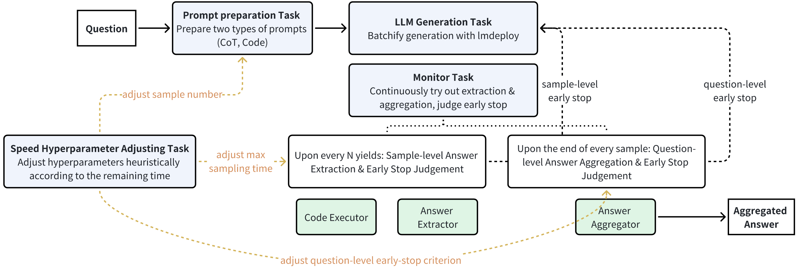

# AI Mathematical Olympiad - Progress Prize 2 Solution ("imagination-research" team)

A simple wrap-up of the competition: The task contains a total of 110 problems at "National Olympiad level" difficulty, provided in plain text LaTeX format. Problem solutions are integers between 0 and 1000. 10 problems serve as the *reference*, 50 problems are for *public leaderboard* evaluation, and 50 problems are for *private leaderboard evaluation*. The leaderboard ranks submissions based on the number of correctly solved problems. Regarding the evaluation platform and computational constraints, one submission solving 50 problems must complete within 5 hours on 4×L4 GPUs (total memory 90GB).

Our solution gets 34/50 on the *public leaderboards* (ranked 1st), and 31/50 (ranked 2nd) on the *private leaderboard*. The submission file is [`imagination_aimo2/local_eval_kaggle.py`](imagination_aimo2/local_eval_kaggle.py).

## Solution Summary

This competition required optimizing both efficiency and reasoning performance. Our final solution consists of three main parts:
* Part I: **Reasoning-Oriented Training** -- *Improve the model's reasoning ability*: Stage 1 - SFT and Stage 2 - DPO with selected data.
* Part II: **Efficiency Optimization** -- *Improve inference efficiency*: Selecting a suitable inference engine, weight quantization, KV cache quantization.
* Part III: **Inference-Time Strategies** -- *Improve efficiency-reasoning performance trade-off*: Prompt design, self-consistency aggregation, sample-level/question-level early stopping, and hyperparameter tweaking.

For local validation, we used the AIME 2025 test set (30 problems) along with the reference set (10 problems), evaluating both average sample accuracy and aggregated accuracy (via self-consistency) to obtain preliminary judgments of our trial solutions. 

Below, we first briefly describe the repository structure, followed by a description of each part of our solution.

## Repository Structure
Data files:
* [`data/aime_2025_30.csv`](data/aime_2025_30.csv): AIME 2025 test set.
* [`data/reference.csv`](data/aime_2025_30.csv): The reference set.

Part I scripts (Requires initializing & updating the submodule, and entering the 360-LLaMA-Factory directory):
* [`scripts/run_sft.sh`](scripts/run_sft.sh): Stage 1 SFT training.
* [`scripts/run_dpo.sh`](scripts/run_dpo.sh): Stage 2 DPO training.

Part II scripts:
* [`scripts/quant_awq.py`](scripts/quant_awq.py), [`scripts/run_quant_awq.sh`](scripts/run_quant_awq.sh): AWQ quantization.
* (Not used in the final submission) [`scripts/quant_rep_kv.py`](scripts/quant_rep_kv.py), [`scripts/run_quant_rep_kv.sh`](scripts/run_quant_rep_kv.sh): Reparametrization for `W_k` and `W_q` for better KV cache quantization.

Submission and local evaluation scripts, configuration files:
* [`imagination_aimo2/local_eval_kaggle.py`](imagination_aimo2/local_eval_kaggle.py): Submission file. Copy this script’s content into the notebook for online submission.
* [`imagination_aimo2/local_eval.py`](imagination_aimo2/local_eval.py): Local evaluation script. Note that although it doesn't use the early stop strategies, one can analyze the effect of early stopping using the saved stats of running this script.
* [`scripts/run_cfg.sh`](scripts/run_cfg.sh): Helper script to run local evaluation (`local_eval.py`). Usage: `SEED=<your random seed> bash scripts/run_cfg.sh <your cfg YAML file> <your data CSV file>`. Results will be saved to `results/<the basename of the cfg file>/seed<the random seed>/<the basename of the data file>/`.
* `cfgs/*.yaml`: Sample configuration files for local evaluation. Note that the configuration for online submission is included in `local_eval_kaggle.py`.

Analysis scripts:
* [`scripts/plot_table_local.py`](scripts/plot_table_local.py):
  * For all result directories given in the command line, extract key stats, and output an overall Markdown table. The results are for our local judgement.
  * Usage: `python scripts/plot_table_local.py <result dir 1> ... <result dir n>`
* [`scripts/analyze_early_stop.py`](scripts/analyze_early_stop.py):
  * For each result directory given in the command line, analyze the token lengths and correctness of multiple answers per sample/question, save images to `<result dir>/answer_refine_vis.pdf`, `<result dir>/answer_token_length.pdf`, `<result dir>/outputs_per_question/<ques_ind>_answer_status.pdf`. The results supports the motivation and reasonability of our early-stopping strategy.
  * Usage: `python scripts/analyze_early_stop.py <result_dir 1> ... <result_dir n>`
* [`scripts/analyze_llm_vote.py`](scripts/analyze_llm_vote.py):
  * A script that analyzes the potential of LLM-based answer aggregation by collecting raw outputs from a given result directory.
  * Usage: `python scripts/analyze_llm_vote.py -h`.
  
## Part I: Reasoning-Oriented Training

(TODO @yyc: remember to put the huggingface urls here)

## Part II: Efficiency Optimization
### Inference Engine
We choose [`lmdeploy`](https://github.com/InternLM/lmdeploy) as the LLM inference framework. Compared with `vllm`, the `lmdeploy` framework with the TurboMind engine can provide higher throughput and shorter model initialization time.

(TODO @yyc: insert the figure)

### Quantization
We apply 4-bit AWQ weight quantization (by calling [`scripts/awq_quantize.py`](scripts/awq_quantize.py)), and 8-bit KV Cache quantization (setting the configuration `main_model.inference_cfg.quant_policy` to 8 to use 8-bit KV Cache quantization implemented by `lmdeploy`).

**Some efficiency results**:
* Online test (4xL4, batch size=15): W4KV8 decreases the time per output token by about 20% compared with W4KV16, (TODO @yyc, get this number, and insert the figure) compared with FP16.
* Local test (2xA100, batch size=32): W4KV8, W4KV16 decreases the overall latency by 40% and 20%-25% compared with FP16, respectively.

**Some reasoning performance results**:
* Local test: The average sample accuracy (not aggregated accuracy) drops by 5%~10%, compared with FP16; W4KV8 is not worse than W4KV16. W4KV4 is worse.


## Part III: Inference-Time Strategies
### Overall Inference Workflow

The inference workflow is shown in the figure below: A question is provided as the input. We first prepare two types of prompts, including the CoT prompt and the Code prompt ("Prompt Preparation Task"). Then, we let the LLM start batchify generation (15 samples) with `lmdeploy` ("LLM Generation Task"). In the mean time, we continuouly try extract the answer from the streaming output of each sample, aggregate the answers of multiple samples, and judge whether to early stop some generation:

1. We do sample-level checking upon every N yields from the iterator got by the `stream_infer(...)` call, and judge whether to early stop the generation of the corresponding sample. The Python code executor and answer extractor components are used here.

2. We do question-level checking upon the end of every sample, and judge whether to early stop the generation of all remaining samples of the current question. The answer aggregator component is used here.

Finally, we return the aggregated answer.



### Prompt Preparation

**Motivation**: It is more suitable for writing code to solve some questions.

**Method**: We use the commonly used code-based reasoning: (1) Prompt the model to provide Python code to solve the problem; (2) Extract Python code from the output, create a subprocess to execute the code; (3) Extract the answer from the execution results

We use two types of prompts: 15 samples, 7 samples use the CoT prompt and 8 samples use the Code prompt:
```yaml
# CoT prompt
- system: "You are a helpful math assistant. Please reason step by step to put the answer in \\boxed{}."
  user_suffix: "\nYou excel at reasoning.\nYou must put the final answer in \\boxed{}.\nIf the final answer is greater than 1000, then take the modulo of 1000.\nThink carefully and thoroughly, avoid duplication."

# Code prompt
- system: "You are a helpful math assistant. Please provide the python code to solve the math problem and also put the final answer in \\boxed{}."
  user_suffix: "\nYou excel at coding\nYou must provide the python code, avoid redundant analysis.\nIf the final answer is greater than 1000, then take the modulo of 1000.\nThe answer must be integer.\nThere is only one answer for each question.\nImport necessary libraries."
```

**Some experiments**:
* System prompt choice: We find diversifying the system prompt doesn't help for reasoning models.
* Prompt list choice: In the local test, we find only using our Code prompt result in a consistent (across seed and models) and small improvements than using half CoT and half code prompts. However, when we submit this (only once), it doesn't help with the public submission score, thus, we don't further test this empirical choice.
* Number of samples: In the local test, we find that using 32 samples achieve better results than using 16 samples. However, due to the limited computing power on the submission platform and limited submission quota, we do not thoroughly experiment with more samples on the submission platform to find a sweet point -- we just go with 15 samples.
* How frequently the code prompt lead to code output, code error, wrong answer (32 samples, 16 CoT Prompts, 16 Code Prompts):
  * Cases where the code runs correctly but we cannot parse an integer from its output are rare and can be ignored.
  * **Before fine-tuning**, the model is more inclined to output code: on average, in only 3.3 out of 16 cases where a code prompt is used, the model does not output code.
  * **After our fine-tuning** with only math data, the model becomes less inclined to output code: on average, in about 11 out of 16 cases, the code prompt does not cause the model to output code. When the new model does output code, its conditional accuracy is slightly higher than the pre-fine-tuning model (45% and 55% vs. 42%).

| Model | Quantization | Total solving time | Avg outlen | Aggregated correct questions (/30) | Average correct samples (/32) | Code error break down (/16) |
|-----|-----|-----|-----|-----|-----|-----|
| dpsk-qwen-14b | KV16 | 11838.22 | 9776.94 | 20.00 | 14.63 | No code: 17.93; Exec error: 2.97; Fail parseint: 0.13; Wrong number: 5.30 |
| dpsk-qwen-14b-awq | AWQ4 KV8 | 6844.75 | 10118.54 | 21.00 | 14.40 | No code: 19.30; Exec error: 2.53; Fail parseint: 0.33; Wrong number: 4.57 |
| dpsk-qwen-14b-finetune-v1-epoch4 | KV16 | 12971.18 | 11151.10 | 21.00 | 18.90 | No code: 27.00; Exec error: 0.83; Fail parseint: 0.03; Wrong number: 1.43 |
| dpsk-qwen-14b-finetune-v1-epoch4-awq | AWQ4 KV8 | 7963.94 | 11557.06 | 21.00 | 16.80 | No code: 27.07; Exec error: 1.30; Fail parseint: 0.03; Wrong number: 0.90 |


### Sample-level Answer Extraction & Early Stopping

**Motivation**: Usually, the reasoning model will self-doubt a lot after obtaining the answer early, even if it usually gives out the same answer finally. And in most cases, after giving the answer between `<think></think>`, the model will rewrite the solution again (at least twice). Can we reduce the wasting of tokens?

**Method**: Although we try the active probing method in "Fu et. al., Efficiently Serving LLM Reasoning Programs with Certaindex, arXiv 2412", in order to simplify our inference workflow, we finally adopt a very simple **sample-level eary-stopping technique**: After detecting the first code that can run without error or first answer in "\\boxed{...}", we early stop the generation process of the corresponding sample.

**Some experiments**: A natural question is that: will this harm the potential of revising a wrong answer to be correct later. In the local test, we use `scripts/analyze_early_stop.py` to verify that these cases are not that usual, as shown in the figure below.


### Question-level Answer Aggregation & Early Stopping

**Motivation**: The difficulty varies across problems, so we don't want to waste much time in solving easy problems. As shown in the figure below, the output length varies considerably across samples for one problem. That indicates that, for some problems, we can get a bunch of correct answers early, but need to wait for longest sample to end, which is a significant time waste, e.g., q1, q11, q16-20, etc.

<p align="middle">
  
</p>

**Method**: We can early stop the generation for the question if enough certainty is achieved by examining existing answers. Specifically, we stop the question-level generation when there are many consistent answers, e.g., 5 out of 7. See the configurations in `early_stop_strategy.consistency_rules` in [`imagination_aimo2/local_eval_kaggle.py`](imagination_aimo2/local_eval_kaggle.py).


## Team and Acknowledgement
* Yichen You (youyc22@mails.tsinghua.edu.cn)
* Xuefei Ning (foxdoraame@gmail.com, project leader)
* Zinan Lin (linzinan1995@126.com)

We are thankful for many helpful online forum discussions and notebooks. We thank Shiyao Li for discussions,  Infinigence-AI for providing 8 A100 GPUs in the early months and 16-24 A100 GPUs in the final two weeks.
